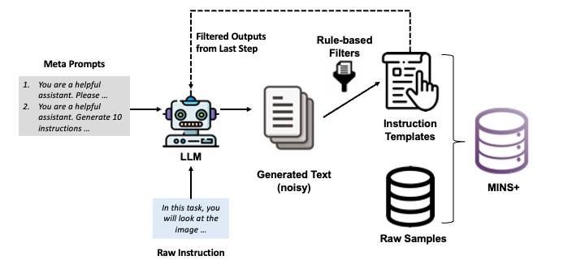
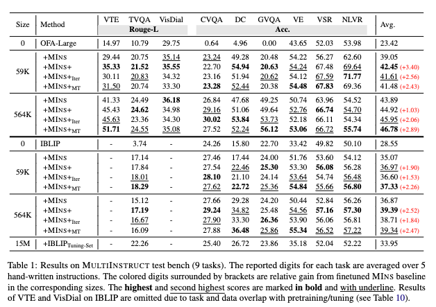
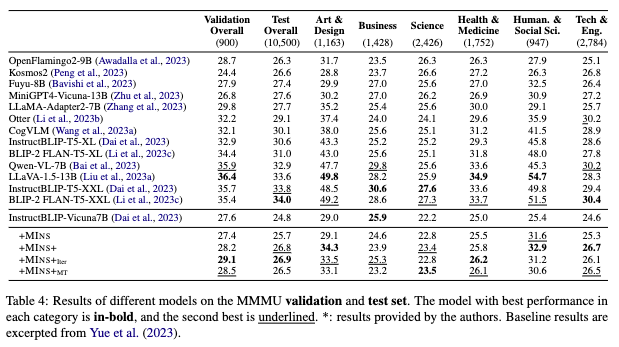

# Robust Instruction Tuning on MLLMs
Official Implementation of the paper: [InstrAug: Automatic Instruction Augmentation for Multimodal Instruction Fine-tuning](https://arxiv.org/pdf/2402.14492.pdf)

## Introduction
InstrAug is a framework for instruction augmentation. It can expand extant small instruction set to __up to 30x__ larger.
The whole pipeline of InstrAug includes (as illustrated in the figure below):
1. Meta-prompt Generation
2. Augmented Instruction Generation and Rule-based Filtering
    * Multi-temp sampling  ($\rm MIns+_{\rm MT}$)
    * Iterative rephrasing ($\rm MIns+_{\rm Iter}$)
3. Instruction-following Dataset Construction

<p align="center">
    <br>
    
    <br>
<p>

We apply InstrAug to Multimodal Instruction Fine-tuning (MIFT) benchmarks and test on 12 downstream tasks from __MultiInstruct__ and __InstrutBLIP-Bench__ and the whole __MMMU benchmark__.
The results show that the model's capability on instruction-augmented dataset (59K) is competitive to or even exceeds non-augmented but larger datasets (564K).

## Repo Hierarchy
The file structure in this repository is as below, we only show important folders/files

    .
    ├── IBLIP                   # Implementation code on Instruct-BLIP
    ├── OFA                     # Implementation code on OFA
    ├── MultiInstruct           # Code to create MINS+
        ├──llama                # Code to generate augmented instructions using LLaMA
        ├──mminstr_dataset      # folder to store MINS and MINS+ dataset 
        └──instruction_data     # folder to store original and generated instruction set 
    ├── LICENSE
    └── README.md

## Usage
Please refer to the README.md under individual folder for more details.

## Results
### 1. Results on MultiInstruct
<p align="center">
    <br>
    
    <br>
<p>

### 2. Results on IBLIP-Bench
<p align="center">
    <br>
    
    <br>
<p>

### 3. Results on MMMU
<p align="center">
    <br>
    
    <br>
<p>

## Citation
Please cite our paper if you find this work useful for your research and applications

```bibtex
@misc{han2024robust,
      title={Towards Robust Instruction Tuning on Multimodal Large Language Models}, 
      author={Wei Han and Hui Chen and Soujanya Poria},
      year={2024},
      eprint={2402.14492},
      archivePrefix={arXiv},
}
```
